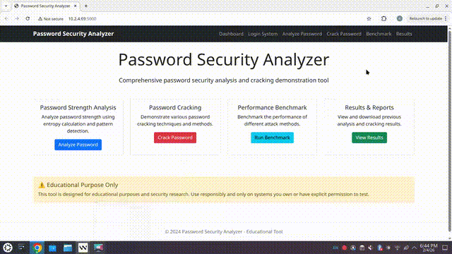

# 🔐 Password Cracking Tool


A comprehensive cybersecurity simulation tool designed to demonstrate the efficacy of various password cracking vectors against different hashing implementations. This project juxtaposes a secure, salted login system against a multi-vector password analysis engine.

## ⚡ Demo

> *Note: This simulation runs in a controlled environment for educational analysis.*



*(If the GIF doesn't load, please check the `media/` folder)*

## 📂 Project Architecture

This tool is split into two distinct modules representing **Defense** (Blue Team) and **Offense** (Red Team):

### 1. The Defense: Secure Login System (`login_system.py`)

A production-grade authentication module implementing industry best practices:

* **Cryptographic Hashing:** Uses SHA-256 with unique per-user salts to neutralize Rainbow Table attacks.
* **Brute Force Mitigation:** Implements an exponential backoff and account lockout mechanism (3 failed attempts).
* **Persistence:** Securely stores credentials in a MySQL database.

### 2. The Offense: Attack Vectors (`password_analyzer.py`)

A benchmarking tool that simulates real-world attack strategies:

* **Dictionary Attack:** Utilizes standard wordlists (e.g., `rockyou.txt` subsets).
* **Brute Force:** Exhaustive key search for short/simple passwords.
* **Hybrid Attack:** Combines dictionary words with common suffix patterns (e.g., "password123").
* **Mask Attack:** Targets specific structural patterns (e.g., Upper-Lower-Digit-Digit).
* **Rainbow Table Attack:** Demonstrates the speed of pre-computed hash lookup vs. dynamic hashing.

---

## 🛠️ Setup & Installation

### Prerequisites

* Python 3.8+
* MySQL Server
* `pip` package manager

### 1. Database Configuration

Access your MySQL instance and set up the environment:
```sql
CREATE DATABASE security;
CREATE USER 'luxury_user'@'localhost' IDENTIFIED BY 'luxury123';
GRANT ALL PRIVILEGES ON security.* TO 'luxury_user'@'localhost';
FLUSH PRIVILEGES;
```


### 2. Usage

**Step 1: Run the Analyzer**

Launch the attack simulation to test the strength of the stored passwords.
```bash
python -m password_analyzer
```

---

## 📊 Technical Implementation Details

The core of this project compares the computational cost of attacking **Unsalted MD5/SHA** vs **Salted SHA-256**.

| Feature | Implementation | Purpose |
| --- | --- | --- |
| **Hashing Algorithm** | SHA-256 | Demonstrates collision resistance standard. |
| **Salting** | `os.urandom(32)` | Prevents pre-computation attacks. |
| **Database** | MySQL Connector | Simulates real-world backend latency. |
| **UI** | Colorama | Provides real-time visual feedback on attack progress. |

### Code Structure
```
├── password_analyzer    # Attack simulation engine
    └──attacks
    └──login
├── wordlists/           # Directory for dictionary files
│   └── common_pass.txt
├── media/               # Demo assets
│   └── demo.gif
└── README.md
```

## ⚠️ Ethical Disclaimer

**This tool is strictly for educational purposes and security analysis.**

It is designed to help developers understand the importance of secure password storage and the mechanics of common vulnerabilities. Do not use this tool against systems you do not own or have explicit permission to test.

---

*Developed by [Abdullakim](https://github.com/Abdullakim1)*
